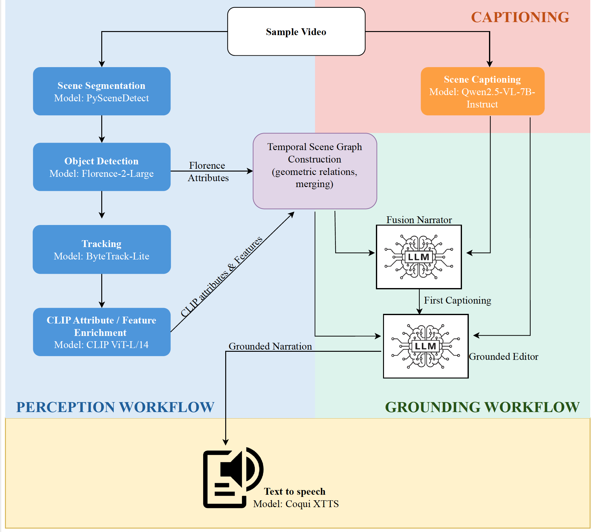

# GMAD  
Grounded Multilingual Audio Description  
Final Project for COSC 89.30 Topics in Video Understanding (Fall 2025) @ Dartmouth College  

## Abstract  
Modern multimodal captioning systems (e.g., GPT-4V, Qwen-VL, LLaVA) inherit systematic biases from English-centric vision encoders such as CLIP, leading to hallucinations and weak grounding. These limitations make them unreliable for applications that require precise and culturally adaptive narration.We propose GMAD, a modular alternative to end-to-end captioning. GMAD replaces monolithic vision–language models with a language-neutral Temporal Scene Graph, constructed from independent detectors, trackers, and attribute models. Narration is generated only after this structured representation is formed, using text-only LLMs directly in the target language.
GMAD demonstrates that accurate multilingual grounded narration does not require multimodal end-to-end learning. Instead, a clean separation between perception and language generation yields more reliable, bias-resistant descriptions across languages and cultures.

---

## Overview  
GMAD is a modular pipeline for generating grounded multilingual audio descriptions from raw video. Visual perception is executed entirely through specialized vision models detection tracking and attribute extraction. Narration is produced by text only LLMs ensuring low hallucination and full language flexibility.

Insert pipeline figure here.  
**(pipeline.png)**  

---

## Pipeline  
GMAD proceeds through a transparent sequence of stages.

### Scene Segmentation  
Splits the video into scenes and extracts representative frames.

### Object Detection  
Uses Florence2 YOLO or RTDETR to identify objects in each frame.

### Tracking  
Associates detections across time using a sparse ByteTrackLite tracker.

### Entity Construction  
Chooses a canonical frame per object and crops entities for analysis.

### CLIP Attribute Enrichment  
Extracts colors materials textures and coarse attributes from each crop.

### Temporal Scene Graph  
Builds a symbolic representation of all objects their attributes their relations and all temporal intervals.

### Qwen Salient Event Extraction  
Uses QwenVL to detect high level actions and scene events.

### LLM Fusion and Grounding  
A text only LLM merges the TSG with Qwen cues generating grounded narration directly in the target language without translation.

### Speech and Audio Layering  
Narration audio is synthesized and aligned with the original video.

---

## Directory Structure  
GMAD/
scene_segmentation/
detection_tracking/
clip_enrichment/
tsg_graph_construction/
qwen/
fusion_layer/
Audio_Layering/
tts/
prompts.yaml
config.yml